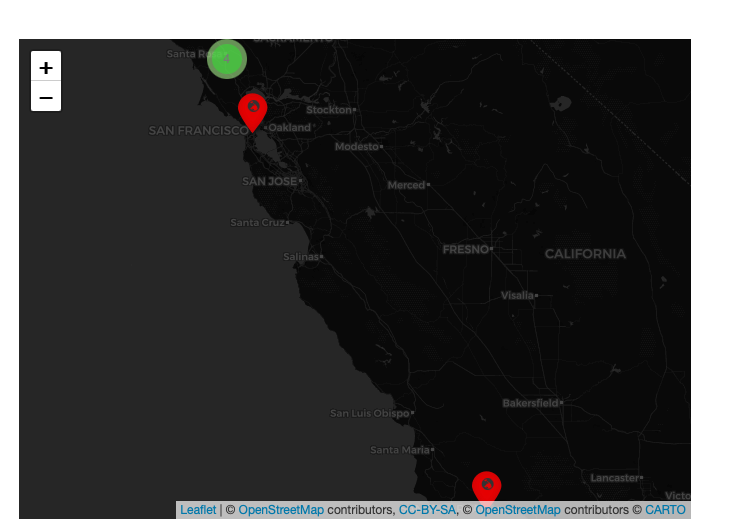
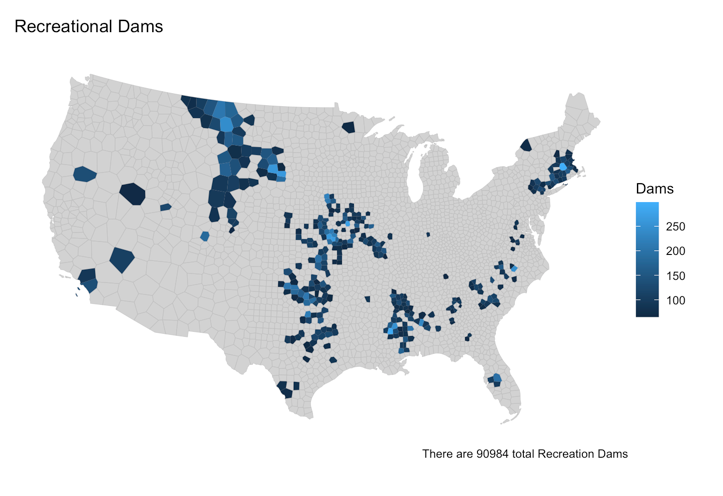
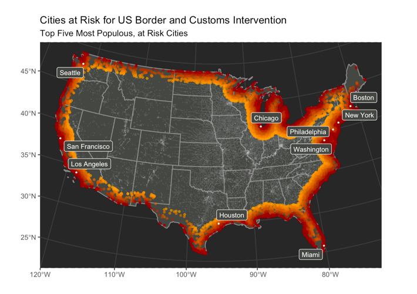
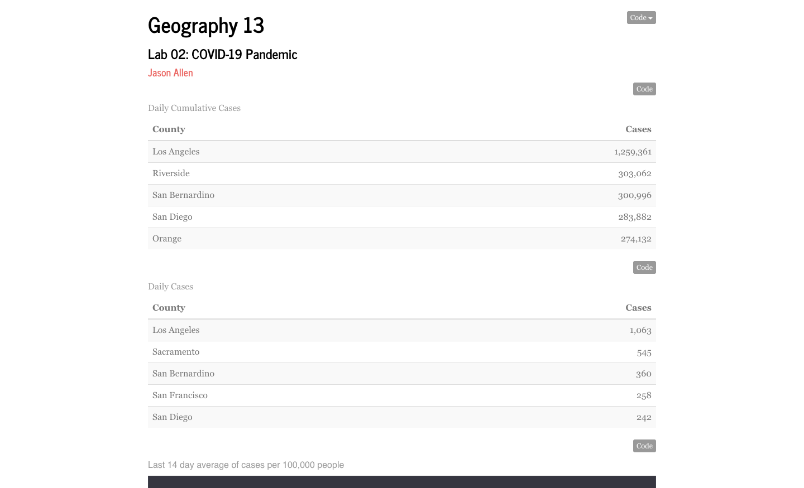
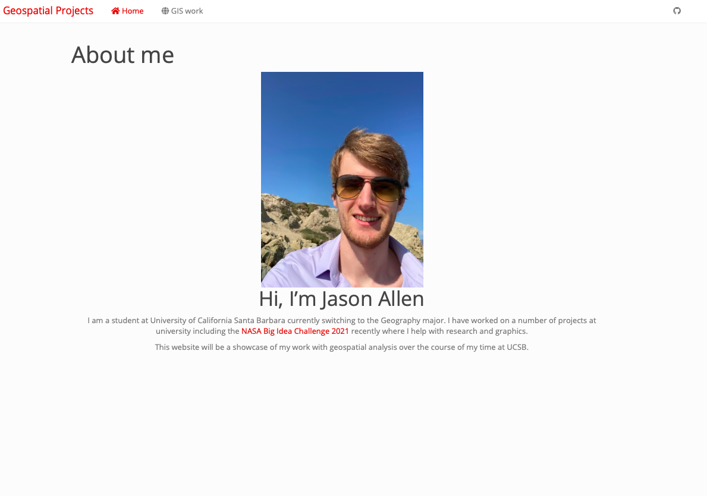

# Fire Map Project 2023
In order to update my personal website so that I can use it as a portfolio for my
resume, I created a map using all the R coding techniques I learned 2 years ago
so that my R skills were refreshed and up to date.

 

# [<i class="fas fa-book"></i> Fire Map 2023](./geog13/docs/fire_map_website.html)
{width=20%}  

# School Projects 2021

The final lab for my maps and spatial reasoning course was creating this website 
and publishing all of my class labs in it.

****  

 

# [<i class="fas fa-book"></i> Interactive Web Mapping](./geog13/docs/geog-w12-lab-7.html)
{width=20%}  

#### This lab coincided quite well with my programming for GIS course since I had already been tought how to make a leaflet map when I got this lab.

      

****

These are some of the coding projects I completed as part of my Programming for GIS course.

      
 

****  

 

# [<i class="fas fa-book"></i> Distances and Border Zone](./geog13/docs/lab-04.html)
{width=20%}  

#### The purpose of this lab was to get acquainted with using gghighlight and creating functions to further automate the processes we're building.

      

 
****  

 

# [<i class="fas fa-book"></i> Distances and Border Zone](./geog13/docs/lab-03.html)
{width=20%}  

#### The purpose of this lab was to get acquainted with using gghighlight and creating functions to further automate the processes we're building.

      
 
****  

 

# [<i class="fas fa-book"></i> Data Wrangling COVID 19](./geog13/docs/lab-02.html)
{width=20%}  

#### This assignment pushed us to utilize the new data manipulation skills we learned
#### in order to analyze the NY Times COVID current data set.

      
 
****  

 

# [<i class="fas fa-book"></i> Building a project website. June 25, 2021](https://mikejohnson51.github.io/spds/lab-01.html)
{width=20%}

- Geography 13 course assignment
- In this assignment we built a static users site with Github Pages 
- Includes a github repo for access to all the code.
- The final step was publishing the site.
- You should be reading this on the website right now.
