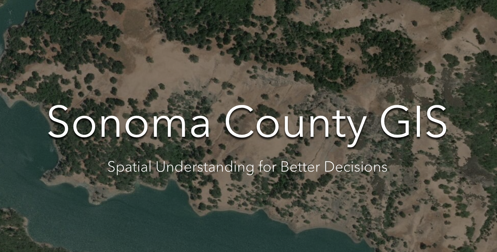

<br><br>

<div class="mycontent">


```{r setup, include=FALSE}
knitr::opts_chunk$set(echo = TRUE)
```

```{css, echo = FALSE}
h1, h2, h3, h4 {
  text-align: center;
}
```

<center>
{width=30%}
</center>


<center>
# About Me
</center>

<hr style="width:30%">

<br>

<center>
I am a GIS designer with experience using ESRI software and R code to analyze data and create maps. I worked at <br>
[Sonoma County GIS](https://gis-sonomacounty.hub.arcgis.com/) as an intern for a year and a half where I polished my GIS skills.
</center>

<br>


<center>


<div class="mycontent">

# My Work

</center>


<hr style="width:30%">


<br><br>


<br>

<a href="https://gis-sonomacounty.hub.arcgis.com/"></a>

<p style="margin-left: 250px">
<font size="+2"><left>
Sonoma County GIS
</left></font>
</p>

<p style="margin-left: 250px">
I was lucky enough to get an internship at Sonoma County GIS which allowed me to experience what working as a GIS technician was like at a professional level. I was also able to learn a lot about the interaction between us and our clients by sitting in on important meetings.
</p>


<br><br><br><br>


****
