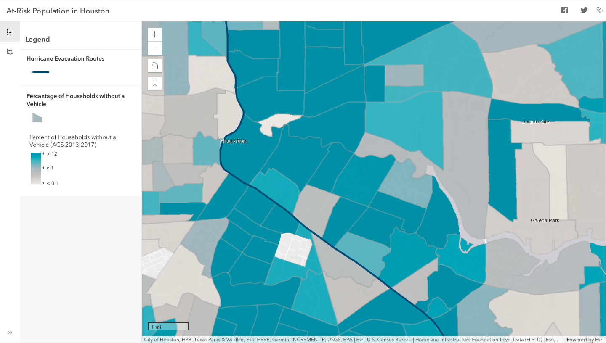

#### This is my current progress toward getting started at my internship.

### [{width=20%}](https://www.arcgis.com/index.html) [Arc GIS Online Profile](https://ucsb.maps.arcgis.com/home/user.html)  
  
  
----  
  
**July, 2021**
  
[{width=30%}](https://ucsb.maps.arcgis.com/apps/instant/minimalist/index.html?appid=cc13827a0121407ca2b2300522c4dce3)
  
  
### [ArcGIS Online Module 3: Detroit Child Poverty](https://ucsb.maps.arcgis.com/apps/instant/minimalist/index.html?appid=cc13827a0121407ca2b2300522c4dce3)  
  
  
*Using census data to find large groupings of children under 14 in low income households.*  
  
----  
  
**July, 2021**  
  
[{width=30%}](https://arcg.is/1Xu8Xu0)
  
  
### [ArcGIS Online Module 2: Research Story Map](https://arcg.is/1Xu8Xu0)  
*There were issues with the storymaps example so I was unable to fully replicate it, I did however manage to try out all of the techniques.*
  
----  
**July, 2021**  
  
[{width=30%}](https://arcg.is/0eK15i0)
  
  
    
### [ArcGIS Online Module 1: At Risk Population in Houston](https://arcg.is/0eK15i0)  
  
  

